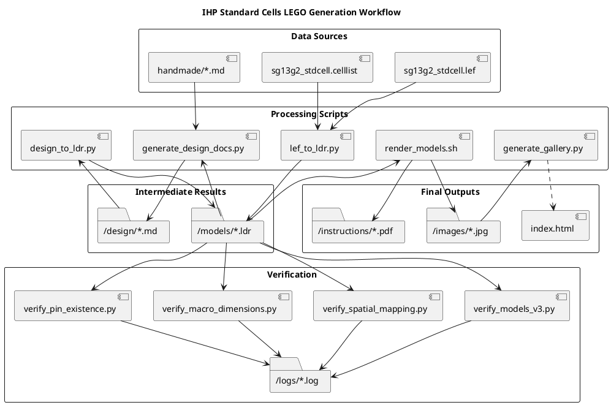

# IHP Standard Cells LEGO Models

This project aims to create LEGO models for all IHP Standard Cells using the LDraw (LDR) format, following the SG13G2 "V3 Gold Standard".

## Project Status

The library consists of 84 standard cells. All cells have been physically mapped from LEF to LDR. Migration to the high-fidelity V3 Gold Standard is currently in progress.

| Metric | Status | Pass Rate |
|--------|--------|-----------|
| **Total Cells** | 84 | - |
| **Physical Mapping** | 84/84 | 100% |
| **Geometric Accuracy** | 84/84 | 100% |
| **Pin Existence** | 84/84 | 100% |
| **V3 Gold Standard Compliance** | 45/84 | 53% |

## Goal
To provide a physical, LEGO-based representation of semiconductor standard cells from the IHP PDK, specifically targeting the SG13G2 process.

## Structure
- `/specifications`: Original and converted (Markdown) standard cell definitions from the IHP PDK.
- `/models`: LEGO LDR models of the cells.
- `/images`: Rendered images of the LEGO models.
- `/design`: Detailed layer-by-layer ASCII art documentation.
- `/handmade`: Manually verified "Gold Standard" reference designs.
- `.github/workflows`: Automated rendering and verification on every push.

## Workflow

The following diagram illustrates the generation and verification workflow:

## Gallery
The generated LEGO models can be viewed in the [IHP LEGO Models Gallery](https://chatelao.github.io/ihp-standard-cells-lego/).

## Reference
- [IHP Open PDK](https://github.com/IHP-GmbH/IHP-Open-PDK)
- [LDraw File Format](https://www.ldraw.org/article/218.html)
